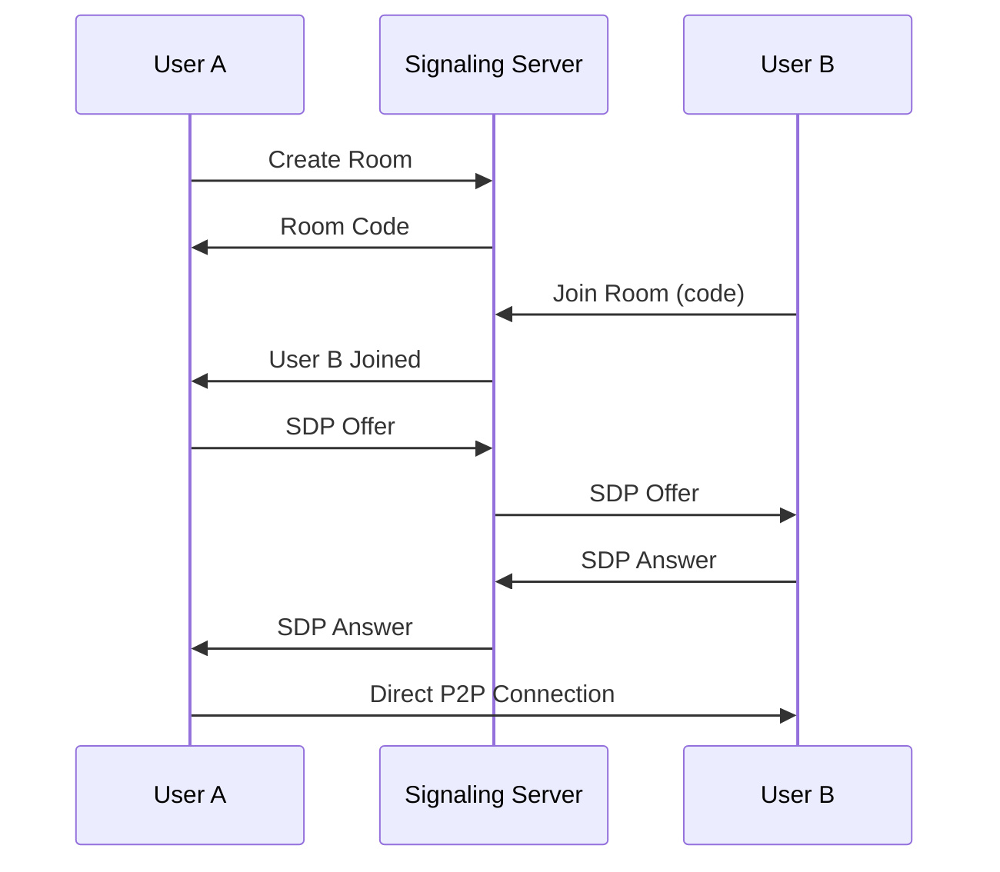

<div align="center">
  
  
  # 🌊 Wave-Connect
  
  ### Modern P2P Video & Audio Calling with Real-Time Visualization
  
  
  
  
  
  
  [✨ Features](#-features) • [🚀 Quick Start](#-quick-start) • [📖 Documentation](#-documentation) • [🤝 Contributing](#-contributing)
  
</div>

---

## 🌟 Overview

**Wave-Connect** is a cutting-edge, peer-to-peer video and audio calling application built with WebRTC. Experience crystal-clear calls with stunning real-time audio visualizations, all wrapped in a beautiful glassmorphic interface.

### ✨ Why Wave-Connect?

- 🔒 **100% Private** - Direct peer-to-peer connections, no data stored on servers
- 🎨 **Beautiful UI** - Monochromatic glassmorphic design with dark/light themes
- 🎵 **Audio Visualization** - Real-time FFT-based spectrum analyzer for audio calls
- 📱 **Fully Responsive** - Seamless experience on desktop, tablet, and mobile
- ⚡ **Lightning Fast** - WebRTC-powered instant connections
- 🌓 **Theme Support** - Elegant light and dark modes

---

## ✨ Features

### 🎥 **Video & Audio Calls**
- High-quality peer-to-peer video calling
- Audio-only call mode with visual feedback
- Automatic call type synchronization between peers
- Camera switching (front/back on mobile)
- Screen sharing support

### 🎵 **Real-Time Audio Visualization**
- FFT-based audio spectrum analyzer
- Pulsing rings around avatars during voice activity
- EQ-style vertical bars reacting to voice input
- Voice Activity Detection (VAD)
- Theme-adaptive visualizers (white/black for light, silver/black for dark)

### 🎨 **Modern UI/UX**
- Glassmorphic design with backdrop blur
- Monochromatic color scheme (white & black)
- Smooth animations and transitions
- Intuitive call controls
- Mobile-optimized interface

### 🔧 **Technical Features**
- WebRTC P2P connections
- WebSocket-based signaling server
- HTTPS/WSS secure connections
- STUN server integration
- SDP offer/answer negotiation
- ICE candidate exchange
- Self-signed SSL certificate generation

---

## 🚀 Quick Start

### Prerequisites

- **Node.js** (v16 or higher)
- **npm** or **yarn**
- Modern web browser with WebRTC support

### Installation

1. **Clone the repository**
   ```bash
   git clone https://github.com/Blaxez/wave-connect.git
   cd wave-connect
   ```

2. **Install dependencies**
   ```bash
   npm install
   ```

3. **Generate SSL certificates** (required for WebRTC)
   ```bash
   node generate-cert.js
   ```

4. **Start the server**
   ```bash
   npm start
   ```

5. **Open your browser**
   ```
   https://localhost:8080
   ```
   
   ⚠️ **Note**: Accept the self-signed certificate warning in your browser

---

## 📖 Documentation

### 🏗️ Architecture

```
wave-connect/
├── public/
│   ├── client.js          # Client-side WebRTC logic
│   ├── index.html         # Main UI
│   └── logo.png           # App logo
├── signaling-server.js    # WebSocket signaling server
├── generate-cert.js       # SSL certificate generator
├── package.json           # Project dependencies
└── .gitignore            # Git ignore rules
```

### 🎯 How It Works

1. **Room Creation**: User A creates a room and receives a unique room code
2. **Room Joining**: User B enters the room code and joins
3. **Signaling**: WebSocket server exchanges SDP offers/answers and ICE candidates
4. **P2P Connection**: Direct peer-to-peer connection established via WebRTC
5. **Media Stream**: Audio/video streams flow directly between peers

### 🔌 WebRTC Flow



### 🎨 UI Components

- **Welcome Screen**: Room creation/joining interface
- **Call Screen**: Active call interface with video feeds
- **Call Controls**: Mic, camera, screen share, hang up buttons
- **Audio Visualizer**: Real-time frequency visualization (audio-only calls)
- **Theme Toggle**: Switch between light/dark modes

### 🔊 Audio Visualization

Wave-Connect uses the **Web Audio API** for real-time audio analysis:

- **FFT Size**: 256 bins
- **Smoothing**: 0.8 for natural transitions
- **Frequency Analysis**: Updates at 60 FPS via `requestAnimationFrame`
- **Visual Elements**:
  - Center EQ bars (12 bars)
  - Avatar pulsing rings
  - Avatar EQ bars (5 bars)

---

## 🎮 Usage

### Creating a Call

1. Enter your name
2. Click **"Create Room"**
3. Select **Voice Call** or **Video Call**
4. Share the room code with your peer
5. Wait for them to join

### Joining a Call

1. Enter your name
2. Enter the room code
3. Click **"Join Room"**
4. Automatically match the host's call type (audio/video)

### Call Controls

| Button | Function |
|--------|----------|
| 🎤 | Toggle microphone on/off |
| 📹 | Toggle camera on/off (video calls only) |
| 🖥️ | Share/stop screen sharing |
| 🔄 | Switch camera (mobile) |
| ❌ | End call |

---

## 🛠️ Configuration

### STUN Servers

The default STUN server is Google's public server. You can modify it in `client.js`:

```javascript
const config = {
  iceServers: [
    { urls: "stun:stun.l.google.com:19302" }
  ]
};
```

### Server Port

Change the port in `signaling-server.js`:

```javascript
const PORT = 8080; // Modify this
```

---

## 🎨 Customization

### Theme Colors

Edit CSS variables in `index.html`:

```css
:root {
  --bg-primary: #ffffff;
  --accent: #000000;
  /* ... more variables */
}

[data-theme="dark"] {
  --bg-primary: #0a0a0a;
  --accent: #c0c0c0;
  /* ... more variables */
}
```

### Visualizer Settings

Customize in `client.js`:

```javascript
localAnalyser.fftSize = 256;  // FFT size
localAnalyser.smoothingTimeConstant = 0.8;  // Smoothing
```

---

## 🌐 Browser Support

| Browser | Support |
|---------|---------|
| Chrome/Edge (Chromium) | ✅ Full Support |
| Firefox | ✅ Full Support |
| Safari | ✅ Full Support |
| Opera | ✅ Full Support |
| Mobile Browsers | ✅ Full Support |

---

## 📱 Mobile Features

- Responsive design optimized for all screen sizes
- Touch-friendly controls
- Front/back camera switching
- Portrait and landscape orientation support
- Optimized bandwidth for mobile networks

---

## 🔒 Privacy & Security

- **No Data Storage**: All calls are peer-to-peer, nothing stored on servers
- **Secure Connections**: HTTPS and WSS (WebSocket Secure) only
- **No Registration**: No accounts, no emails, completely anonymous
- **Temporary Rooms**: Rooms exist only during active sessions

---

## 🤝 Contributing

Contributions are welcome! Please feel free to submit a Pull Request.

1. Fork the repository
2. Create your feature branch (`git checkout -b feature/AmazingFeature`)
3. Commit your changes (`git commit -m 'Add some AmazingFeature'`)
4. Push to the branch (`git push origin feature/AmazingFeature`)
5. Open a Pull Request

---

## 📝 License

This project is licensed under the **ISC License** - see the [LICENSE](LICENSE) file for details.

---

## 👨‍💻 Author

**Santosh Maurya**

- GitHub: [@Blaxez](https://github.com/Blaxez)
- Project: [Wave-Connect](https://github.com/Blaxez/wave-connect)

---

## 🙏 Acknowledgments

- [WebRTC](https://webrtc.org/) - Real-time communication technology
- [Node.js](https://nodejs.org/) - JavaScript runtime
- [Express](https://expressjs.com/) - Web framework
- [ws](https://github.com/websockets/ws) - WebSocket library

---

<div align="center">
  
  ### ⭐ Star this repo if you like it!
  
  **Made with ❤️ by Santosh Maurya**
  
  [⬆ Back to Top](#-wave-connect)
  
</div>
